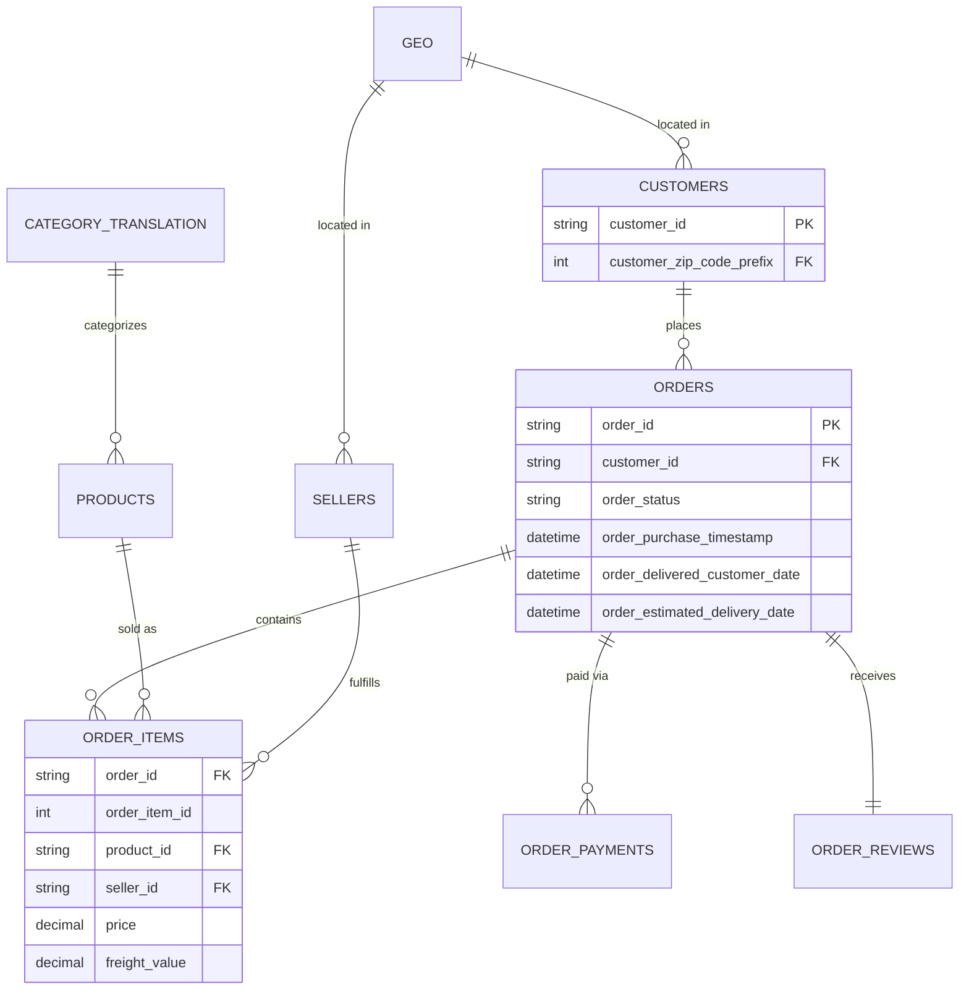

# Magist E-Commerce Marketplace Analysis

SQL-based business analysis of a Brazilian e-commerce marketplace, built to answer questions a growth or operations team would actually ask: where does revenue come from, where is the customer experience breaking down, and how dependent is the business on a handful of sellers.

## Business context

Magist is a B2B SaaS company that helps independent Brazilian retailers sell through an online marketplace. This analysis works with order-level marketplace data to support decisions around growth priorities, logistics quality, and seller risk.

## Data

The dataset is the **Brazilian E-Commerce Public Dataset by Olist** (~100k orders, Sep 2016 – Oct 2018), available publicly on [Kaggle](https://www.kaggle.com/datasets/olistbr/brazilian-ecommerce) under a CC BY-NC-SA 4.0 license. Raw data isn't bundled in this repo (size + license); see [`data/README.md`](data/README.md) for how to get it and load it locally.

### Entity-relationship overview



## Tools

SQL (MySQL syntax) — schema design, exploratory queries, and the full business-question analysis.

## Key findings

Based on ~96.5k delivered orders between September 2016 and October 2018:

- **Late deliveries hit satisfaction hard.** Orders that arrive after the estimated delivery date average a **2.55-star** review, vs. **4.29 stars** for on-time or early orders. About **8%** of delivered orders arrive late, and average delivery time is **12.6 days**.
- **Revenue is concentrated in a small group of sellers.** The top 10% of sellers (by revenue) account for **67%** of total revenue — a meaningful dependency risk if a handful of those sellers churn.
- **Health & beauty, watches/gifts, and bed/bath/table** are the top three categories by revenue, but watches & gifts has the highest average item price (~€199) of the top categories, suggesting a different growth lever (fewer, higher-value orders) than bed/bath/table (~€93 average item price, higher volume).
- **Credit card dominates payment behaviour** — 76.8k of ~103.9k payments (about 3.5 installments on average), while boleto (a common Brazilian payment slip) is used in roughly a fifth of payments with no installments.
- **Review scores skew positive but with a meaningful unhappy tail**: 57.5% are 5-star, but 11.8% are 1-star — almost as many 1-star as 3-star reviews, which lines up with the delivery-delay finding above.
- **São Paulo (SP) dominates** both order volume and revenue by a wide margin, followed by Rio de Janeiro (RJ) and Minas Gerais (MG) — useful for prioritising regional logistics or seller-acquisition efforts.

## How to reproduce

1. Set up a MySQL (or compatible) database and run `sql/01_schema.sql`.
2. Download the dataset from Kaggle (see `data/README.md`) and load each CSV into its matching table.
3. Run `sql/02_data_exploration.sql` to sanity-check the load.
4. Run `sql/03_business_questions.sql` for the full analysis. Pre-aggregated results for each question are also in `/exports` if you want to skip straight to the numbers.

## Repo structure

```
sql/        schema, exploration, and business-question queries
data/       instructions for sourcing the raw dataset (not included)
exports/    aggregated CSV results for each business question
```
